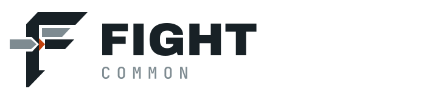

<picture>
  <source media="(prefers-color-scheme: dark)" srcset="docs/assets/identity/fight-common-readme-dark.svg">
  
</picture>

# Fight Common

[](https://github.com/johnnickell/fight-common/actions/workflows/tests.yml)
[](https://www.php.net/)
[](LICENSE)

Framework-neutral PHP building blocks for applications that keep business rules independent from frameworks and
infrastructure. Fight Common gives experienced PHP teams focused domain primitives, application contracts, and
optional adapters without taking ownership of the application around them.

```bash
composer require johnnickell/fight-common
```

[Quick Start](https://johnnickell.github.io/fight-common/quick-start/) ·
[Architecture](https://johnnickell.github.io/fight-common/architecture/) ·
[Component Atlas](https://johnnickell.github.io/fight-common/#component-atlas) ·
[Framework Support](https://johnnickell.github.io/fight-common/frameworks/framework-support/)

## Inward architecture

Dependencies point inward: **Adapter → Application → Domain**.

| Layer | Owns |
| --- | --- |
| **Adapter** | Framework, provider, and infrastructure integration. |
| **Application** | Use-case coordination and ports expressed against the Domain. |
| **Domain** | Pure business rules and durable primitives with no framework dependency. |

The [Architecture guide](https://johnnickell.github.io/fight-common/architecture/) is authoritative for the
complete dependency policy and enforcement model.

## Choose a capability

| Model | Coordinate | Connect | Operate |
| --- | --- | --- | --- |
| [Values](https://johnnickell.github.io/fight-common/components/values/) | [Messaging](https://johnnickell.github.io/fight-common/components/messaging/) | [HTTP Client](https://johnnickell.github.io/fight-common/components/http-client/) | [Observability](https://johnnickell.github.io/fight-common/components/observability/) |
| [Specifications](https://johnnickell.github.io/fight-common/components/specifications/) | [Validation](https://johnnickell.github.io/fight-common/components/validation/) | [Cache](https://johnnickell.github.io/fight-common/components/cache/) | [Process](https://johnnickell.github.io/fight-common/components/process/) |
| [Event Sourcing](https://johnnickell.github.io/fight-common/components/event-sourcing/) | [Dependency Injection](https://johnnickell.github.io/fight-common/components/dependency-injection/) | [Mail](https://johnnickell.github.io/fight-common/components/mail/) | [Scheduler](https://johnnickell.github.io/fight-common/components/scheduler/) |

The [Repositories guide](https://johnnickell.github.io/fight-common/components/repositories/) and the complete
[Component Atlas](https://johnnickell.github.io/fight-common/#component-atlas) hold the implementation detail;
this README stays deliberately compact.

## JSend response compatibility

Fight Common retains its published `1.x` framework-neutral envelope and Symfony response behavior. The
[Validation guide](https://johnnickell.github.io/fight-common/components/validation/) is the authoritative route
for response composition and integration guidance.

## Project routes

- Read the [documentation](https://johnnickell.github.io/fight-common/) or begin with the
  [Quick Start](https://johnnickell.github.io/fight-common/quick-start/).
- Check supported integration paths in [Framework Support](https://johnnickell.github.io/fight-common/frameworks/framework-support/).
- See how to [contribute](https://johnnickell.github.io/fight-common/maintenance/contributing/).
- Browse the [repository](https://github.com/johnnickell/fight-common), [source](https://github.com/johnnickell/fight-common/tree/main/src),
  and [changelog](CHANGELOG.md).
- Fight Common is available under the [MIT License](LICENSE).

Copyright © 2026 John Nickell.
