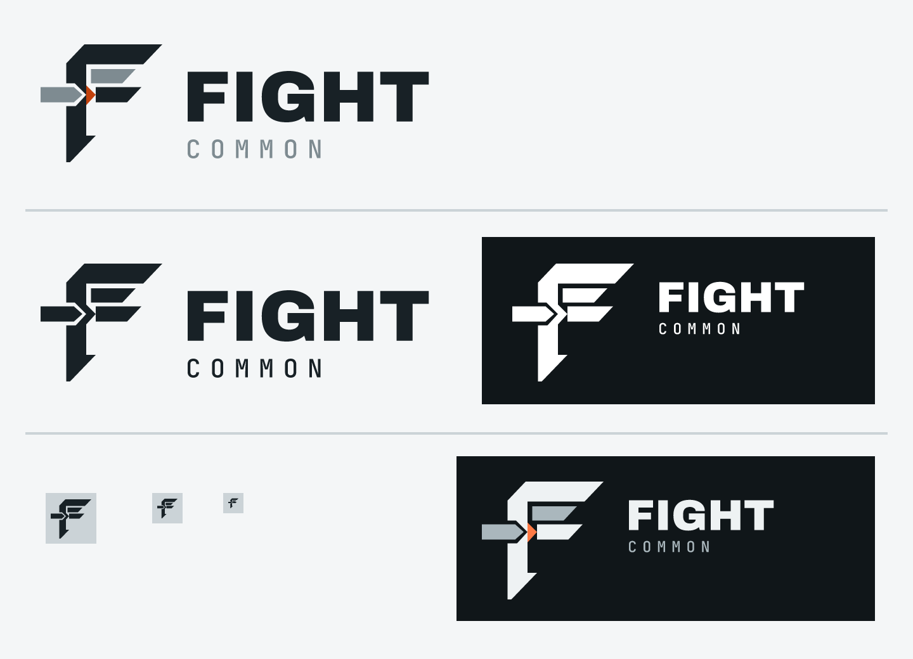

# Fight identity

The Fight identity expresses a boundary that holds under load. Its canonical **Inward Port — No Lower Rail**
mark combines a structural `F`, an inbound approach rail, a kiln-orange active port, one upper ownership rail,
and deliberately open lower counterspace. The geometry—not an effect or color alone—carries the meaning.



## Construction

The editable [master SVG](assets/identity/source/fight-identity-source.svg) keeps three reusable components
separate: the standalone mark, the stable heavy-grotesk `FIGHT` family wordmark, and the independently outlined
monospaced `COMMON` product descriptor. All published vectors and rasters are generated from that same vector geometry, with no
installed font, embedded image, remote reference, gradient, shadow, or script dependency.

The lower counterspace must remain open. The steel approach rail enters from the left through the triangular
kiln port centered on the middle arm; it is an inbound dependency path, not an added lower bar. The short steel
rail in the upper counter is the only ownership rail.

## Size and clear space

Use `1x` clear space on every side, where `x` is the height of the structural middle arm. This applies to both
the standalone mark and every lockup.

| Composition | Minimum size |
| --- | ---: |
| Standalone full-color mark | 32px |
| Standalone one-color mark | 16px |
| Horizontal Fight Common lockup | 120px wide |
| Compact stacked lockup | 72px wide |

Use the prepared favicon exports at 16px and 32px. Do not scale the full horizontal or stacked lockups down to
favicon size.

## Color and backgrounds

| Role | Light surface | Dark surface |
| --- | --- | --- |
| Canvas | `#F4F6F7` | `#101619` |
| Structure | `#182126` | `#EEF2F3` |
| Steel rail | `#7E8B91` | `#AAB7BD` |
| Kiln port | `#C2410C` | `#FF7A45` |

Use light variants on the light canvas or white. Use dark variants on the dark canvas or an equivalently dark,
quiet neutral. Use the reversed asset only on a background that provides at least 4.5:1 contrast. The one-color
asset must remain a single solid color; never recolor only the port in a constrained treatment.

The validated contrast ratios against the intended canvases are:

| Boundary | Light | Dark |
| --- | ---: | ---: |
| Structure | 15.08:1 | 16.19:1 |
| Steel rail | 3.23:1 | 8.88:1 |
| Kiln port | 4.78:1 | 7.06:1 |

The steel rail is an essential graphical boundary and clears the 3:1 non-text threshold. Structure and kiln
also clear 4.5:1, although the identity is never a substitute for readable product text.

## Prepared assets

| Need | Asset |
| --- | --- |
| Standalone mark | [Full color](assets/identity/fight-mark-full-color.svg), one color for [light](assets/identity/fight-mark-one-color-light.svg) or [dark](assets/identity/fight-mark-one-color-dark.svg) surfaces, [reversed](assets/identity/fight-mark-reversed.svg) |
| Theme mark | [Light surface](assets/identity/fight-mark-light.svg), [dark surface](assets/identity/fight-mark-dark.svg) |
| Family-only lockup | [Light](assets/identity/fight-family-horizontal-light.svg), [dark](assets/identity/fight-family-horizontal-dark.svg), one color for [light](assets/identity/fight-family-horizontal-one-color-light.svg) or [dark](assets/identity/fight-family-horizontal-one-color-dark.svg) surfaces, [reversed](assets/identity/fight-family-horizontal-reversed.svg) |
| Fight Common horizontal | [Light](assets/identity/fight-common-horizontal-light.svg), [dark](assets/identity/fight-common-horizontal-dark.svg), one color for [light](assets/identity/fight-common-horizontal-one-color-light.svg) or [dark](assets/identity/fight-common-horizontal-one-color-dark.svg) surfaces, [reversed](assets/identity/fight-common-horizontal-reversed.svg) |
| Fight Common stacked | [Light](assets/identity/fight-common-stacked-light.svg), [dark](assets/identity/fight-common-stacked-dark.svg), one color for [light](assets/identity/fight-common-stacked-one-color-light.svg) or [dark](assets/identity/fight-common-stacked-one-color-dark.svg) surfaces, [reversed](assets/identity/fight-common-stacked-reversed.svg) |
| GitHub README | [Light](assets/identity/fight-common-readme-light.svg), [dark](assets/identity/fight-common-readme-dark.svg) |
| Browser and device | [One-color SVG favicon](assets/identity/favicon.svg), [16px PNG](assets/identity/favicon-16.png), [32px PNG](assets/identity/favicon-32.png), [multi-size ICO](assets/identity/favicon.ico), [touch icon](assets/identity/apple-touch-icon.png) |
| Social and profile | [1280×640 social image](assets/identity/fight-common-social-1280x640.png), [512px avatar](assets/identity/fight-avatar-512.png) |

Images require meaningful alternative text in context. Do not use a logo as a replacement for a heading,
project name, navigation label, or other necessary text.

## Do not

- Stretch, rotate, skew, outline, crop, or rearrange the mark or lockups.
- Add a lower rail, extra ownership rail, badge, container shape, slogan, or architecture label.
- Add gradients, shadows, bevels, textures, animation, or color effects.
- Treat the port as decorative orange or replace the selected palette with framework colors.
- Typeset `FIGHT` or `COMMON` with a local font in place of the outlined geometry.

## Reproduction

Regenerate and validate the family from the repository root:

```bash
python scripts/generate_identity_assets.py
python scripts/generate_identity_assets.py --check
python scripts/validate_identity_assets.py docs/assets/identity
```

The committed [manifest](assets/identity/manifest.json) records the exact inventory, intrinsic dimensions,
approved palette, editable source, and generator. These repository-owned files are the production authority;
external image or font dependencies are intentionally absent.
